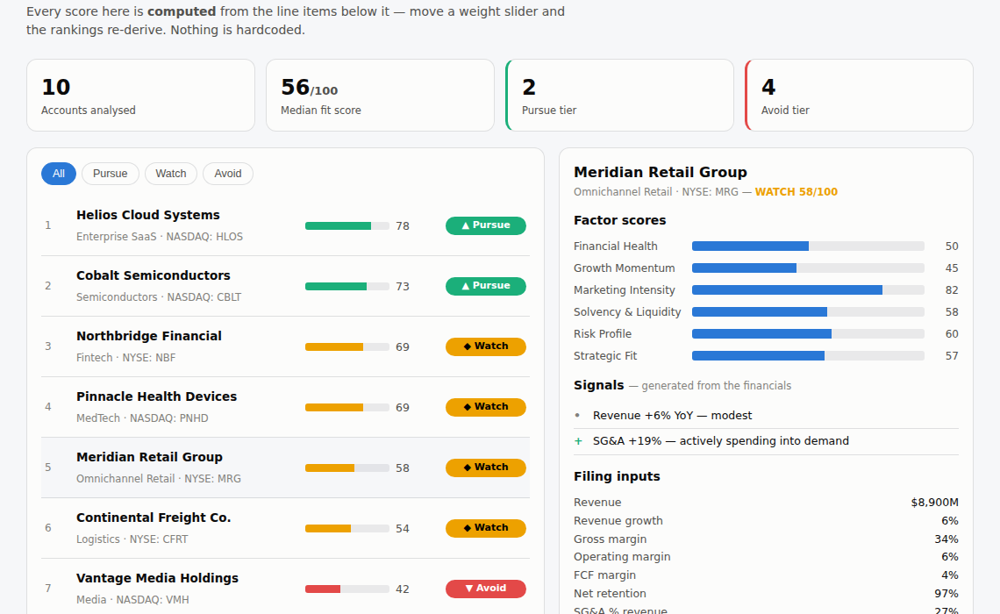

# Account Intelligence

Ten prospective accounts scored from 10-K-style financials into **Pursue / Watch / Avoid**. Every number on the page is derived; move a weight slider and the rankings re-compute.

**[▶ Open it](https://abenezer0101.github.io/projects/account-intelligence-v2/)** · `node test_score.mjs` — 28 tests



## What was wrong with the original

The first version of this project *claimed* to score companies "from 10-K signals." It didn't. The six factor scores were hand-typed constants:

```js
{n:"Helios Cloud Systems", fin:88, growth:92, mkt:80, solv:84, risk:78, fit:90, ...}
```

The composite was a weighted blend of numbers someone chose, and the "signals" beside them were decorative strings with no link to the scores. Editing a signal changed nothing. Editing a score changed nothing else. It was a picture of a model.

## What this one does

Companies carry **financial line items only** — no scores:

```js
{ name:'Helios Cloud Systems', revenueMillions:1840, revenueGrowth:34,
  grossMargin:78, operatingMargin:12, fcfMargin:18, netRetention:121,
  sgaPctRevenue:38, sgaGrowth:28, debtToEbitda:1.1, interestCoverage:14,
  cashRunwayMonths:60, riskFactorCount:28, goingConcern:false, ... }
```

Each of the six factors is computed from those inputs through a documented piecewise curve:

| Factor | Weight | Derived from |
|---|---|---|
| Financial Health | 25% | gross / operating / FCF margin |
| Growth Momentum | 20% | revenue growth, net retention, backlog |
| Marketing Intensity | 18% | SG&A as % of revenue, SG&A growth, ad-spend growth |
| Solvency & Liquidity | 15% | debt/EBITDA, interest coverage, current ratio, cash runway |
| Risk Profile | 12% | *inverted* — risk-factor count, concentration, going concern, material weakness |
| Strategic Fit | 10% | sector match against the buyer profile, revenue band, tech spend |

**Signals are generated from the data too.** A going-concern signal appears if and only if `goingConcern` is true. They can't drift out of sync with the score beside them, which is precisely what hand-written signal text does the moment anyone edits a number.

## What the model surfaces

Two results the hardcoded version couldn't have produced, because they emerge from tension between factors:

**Vantage Media scores 86 on Marketing Intensity while landing in Avoid.** It is spending aggressively into demand — SG&A +21%, ad spend +26% — while carrying 4.1× leverage, 2.2× interest coverage, negative free cash flow and a disclosed material weakness. It looks like a hot lead and is a credit risk. A single blended number would hide that; the factor breakdown shows exactly where the appeal and the danger each come from.

**Aster Biopharma has the highest Growth Momentum of any Avoid account (78)** against a Risk Profile of **0** — 41% revenue growth, going-concern language, 17 months of runway, 44% customer concentration. Growth alone is not a buying signal.

The weight sliders make the disagreement explicit: raising the Risk weight to 40% moves 9 of the 10 scores and reshuffles the ranking. If your team weights risk differently, the model says so rather than pretending there is one answer.

## Tests

28 tests, and the interesting ones are **monotonicity properties** rather than fixed expected values:

- more revenue growth never *lowers* the composite
- more debt never *raises* it
- going concern and material weakness always lower it
- every factor and composite stays within 0–100
- degrading a Pursue company's inputs flips it to Avoid
- Strategic Fit responds to the *buyer profile*, not only the company
- signals always agree with the data that produced them
- **the input dataset contains no score fields at all** — asserted, so the old failure mode cannot come back

Property tests suit a scoring model better than golden values: they check the model *behaves like a model*, and they keep passing when you tune a curve.

## Files

| File | Purpose |
|---|---|
| `score.js` | The model — curves, six factors, composite, signal generation |
| `data.js` | Financial inputs only |
| `test_score.mjs` | 28 tests |
| `index.html` | UI with live weight sliders |

Companies and financials are fictional, shaped to resemble 10-K disclosures. This is a scoring-model demonstration, not investment advice.

## Skills

Scoring-model design, piecewise normalisation, weighted composites, derived-vs-stored data, property-based testing, interactive sensitivity analysis.
