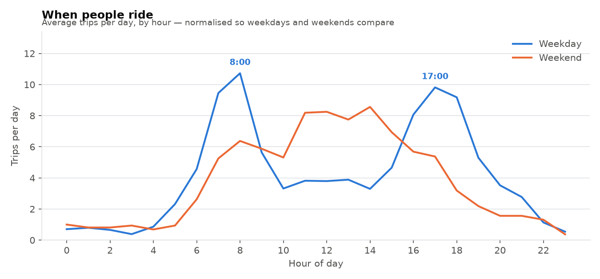
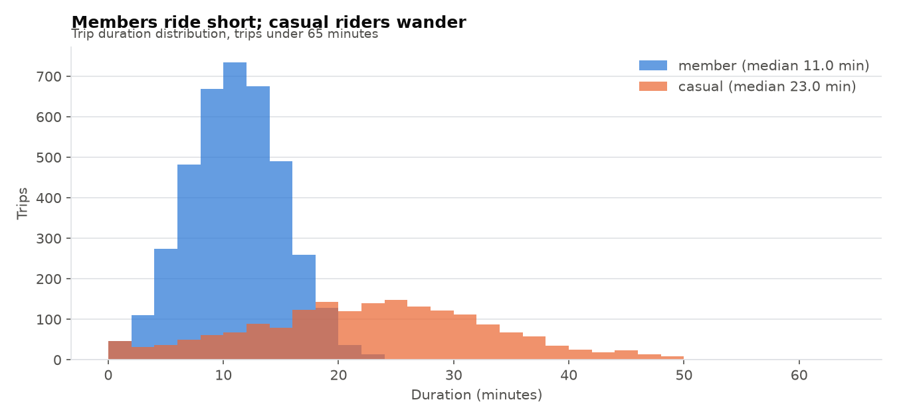
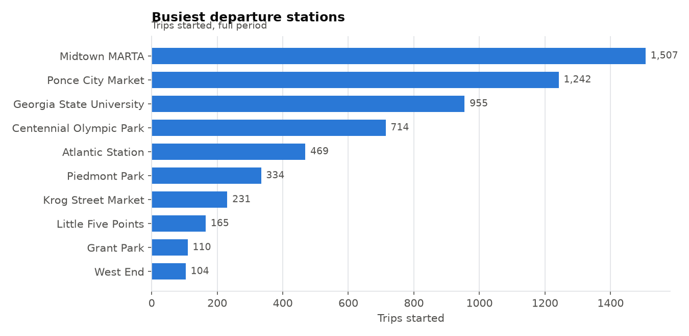

# Bike-Share Data Cleaning

A messy trip export, cleaned with a full audit trail, then analysed into three charts. The point of this project is the cleaning: **every row removed is counted and attributed**, because a script that silently drops rows is indistinguishable from a broken one.

```bash
pip install pandas matplotlib
python3 make_messy_data.py   # regenerate the raw export (seeded)
python3 clean.py             # cleaning + audit report
python3 plots.py             # render charts/
```

## The mess

`data/trips_raw.csv` carries defects that all appear in real trip data:

- **Three date formats** in the same columns (`2026-06-30 18:22:00`, `06/25/2026 10:24`, `25-Jun-2026 10:24`)
- **Station name drift** — casing, stray whitespace, abbreviations (`PIEDMONT PARK`, `  Piedmont Park `, `Krog St. Market`)
- **Negative durations** from clock skew — the ride ends before it starts
- **Undocked bikes** — trips lasting 3 to 21 days
- **Sub-minute trips** — docking errors and staff rebalancing
- **Duplicate ride IDs** — the same ride exported twice
- **Missing** end stations and user types

## The audit

```
step                                 rows   note
------------------------------------------------------------------------------
rows read                           6,041   
duplicate ride_id removed              45   same ride exported twice
station name variants collapsed        34   44 raw spellings -> 10 stations
unparseable timestamps dropped          0   three formats attempted
negative durations dropped             34   end before start — clock skew
sub-minute trips dropped               64   docking errors / rebalancing
trips over 24h dropped                 67   bike never redocked
missing end stations labelled          72   kept as 'Unknown'
missing user types labelled            68   kept as 'unknown'
rows kept                           5,831   96.5% of input
```

**Dropped vs. labelled is a judgement, not a default.** A negative duration is unusable, so it goes. A missing user type is not — the trip still happened and still counts toward volume, so it becomes `unknown` rather than disappearing. Dropping those rows would quietly bias every volume figure downward.

## Findings



**Weekday and weekend are different systems.** Weekdays show twin commute peaks at 8:00 and 17:00. Weekends have no commute signal at all — one broad hump peaking around midday. Normalising to trips *per day* matters here: five weekdays against two weekend days would otherwise make weekends look small regardless of behaviour.



**Casual riders ride 2.09× longer than members** — 23.0 min median against 11.0. The distributions barely overlap: members cluster tight, casual riders spread past 45 minutes. Members commute; casual riders sightsee. Median rather than mean, because the long tail drags the mean to 14.7 against a 12.6 median.



**Demand is concentrated.** Midtown MARTA starts 1,507 trips against West End's 104 — a 14× spread across ten stations. The top three (3,704 trips) outweigh the other seven combined (2,127).

## Three bugs I caught by looking at the output

None of these would have been found by reading the code or the summary numbers.

1. **A weekday/weekend chart that showed both peaking at rush hour.** Real weekends have no commute peak. My generator drew every day's hours from one commute-shaped distribution, so the pattern was manufactured by me and looked like a finding. Weekends now use a leisure-shaped distribution.

2. **A station chart that was flat** — a 17% spread across ten stations, reading as "everywhere is equally busy." The generator sampled stations uniformly; real systems are heavily skewed. Weighted, the spread is 14×.

3. **A phantom eleventh station.** The abbreviation rule was `\bSt\.$` — anchored to end-of-string, so it expanded `Main St.` but never `Krog St. Market`, where the abbreviation sits mid-name. 13 trips stayed stranded under a duplicate station that the cleaning report counted as real. Fixed with a lookahead; Krog Street Market picked up its missing rides (231 total) and the station count fell from 11 to 10.

The third one is the dangerous kind: the audit table said the cleaning had succeeded, and it was wrong. Only the chart showed it.

**Naive `.title()` also breaks acronyms** — it turned `MIDTOWN MARTA` into `Midtown Marta`. Acronyms are restored after casing.

## Files

| File | Purpose |
|---|---|
| `make_messy_data.py` | Seeded generator for the raw export |
| `clean.py` | Cleaning pipeline + audit report + findings |
| `plots.py` | Three charts to `charts/` |
| `data/trips_raw.csv` | 6,041 rows, uncleaned |
| `data/trips_clean.csv` | 5,831 rows, analysis-ready |

Synthetic data modelled on Atlanta stations; the defects are real patterns, the rides are generated.

## Skills

pandas cleaning pipelines, multi-format date parsing, outlier thresholds, drop-vs-label decisions, audit trails, matplotlib, and distinguishing real findings from data-generation artifacts.
