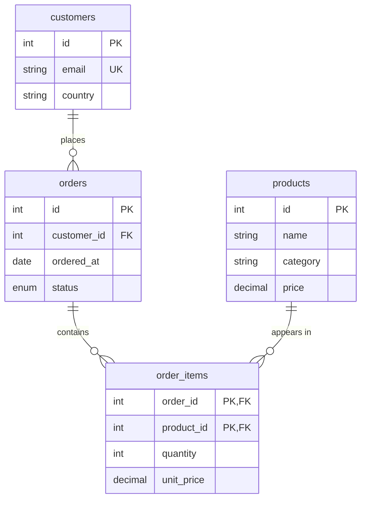

# E-commerce Analytics Database

A relational schema and analytics query set for an online store — customers, products, orders, and line items — answering the questions a shop dashboard runs on: revenue, AOV, top products, and refund rate.

## Model



**Design notes:**
- Order total is **derived** (`SUM(quantity × unit_price)`), never stored — no update anomalies.
- `unit_price` is captured on the line item at purchase time, so later price changes don't rewrite history.
- `status` (`paid` / `refunded` / `cancelled`) gates every revenue query — only `paid` counts.

## Queries (`sql/03_queries.sql`)

Revenue + AOV · revenue by category · top customers · best-selling products · monthly revenue trend · refund/cancellation rate (window function for %) · repeat customers.

## Verified results (paid orders only)

| Metric | Value |
|---|---|
| Revenue | **$374.22** |
| Paid orders | 5 |
| Average Order Value | **$74.84** |
| Top category | Electronics ($282.47) |
| Top customer | Amara ($134.24) — also the only repeat buyer |
| Order mix | 71.4% paid, 14.3% refunded, 14.3% cancelled |

Every figure was computed in SQLite against the seed data before commit.

## Run

```bash
mysql -u root -p < sql/01_schema.sql
mysql -u root -p shop < sql/02_seed.sql
mysql -u root -p shop < sql/03_queries.sql
```

## Skills

Star-shaped transactional modeling, derived vs. stored values, `DECIMAL` money handling, multi-table joins, `GROUP BY`/`HAVING`, window functions for share-of-total, cohort/repeat analysis.
