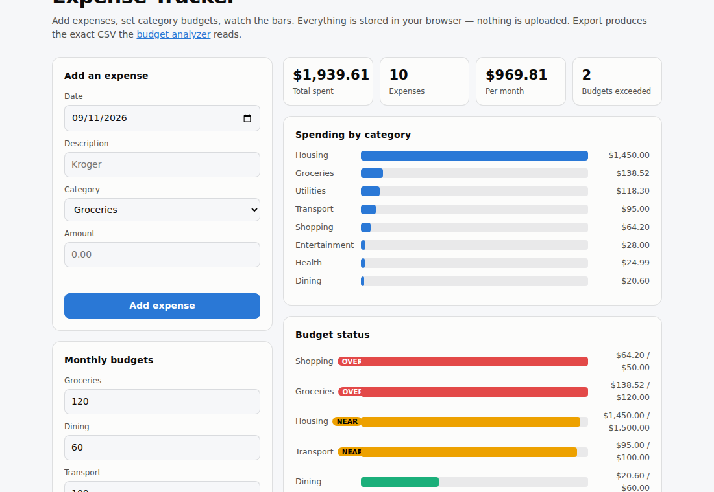

# Expense Tracker

Add expenses, set category budgets, watch the bars. Everything lives in your browser — nothing is uploaded, no account, no backend.

**[▶ Open the tracker](https://abenezer0101.github.io/projects/expense-tracker/)**



```bash
node test_app.mjs        # 35 logic tests, no browser needed
python3 -m http.server   # then open localhost:8000
```

## How this differs from the budget analyzer

The [budget analyzer](../budget-analyzer/) *reads* a bank CSV and reports on it — passive analysis of data you already have. This is the other half: a CRUD app that **produces** that data. It owns state, validates input, persists across reloads, and supports undo.

They chain: **Export CSV here → import it there.** The export writes `date,description,amount` with expenses as negatives, which is exactly the shape the analyzer parses.

## What it does

- **Add / delete expenses** with validation — no zero or negative amounts, no blank descriptions, no malformed dates
- **Category budgets** with status at a glance: green under 80%, amber at 80%, red past 100%
- **Undo** on delete, restoring the row to its original position
- **CSV import and export**, round-tripping cleanly
- **Persists in `localStorage`** through reloads, with a versioned schema

## Engineering decisions

**Logic lives in `app.js`, not the page.** Pure functions for validation, totals, budgets, and CSV can be tested in Node in milliseconds without a browser. The HTML only wires events to them. That split is why there are 35 logic tests *and* 15 browser tests instead of a handful of slow ones.

**The storage schema is versioned.** `load()` migrates a v1 bare array into the v2 `{expenses, budgets}` shape rather than discarding it. Shipping a storage format without a migration path means the next change silently wipes real users' data.

**Storage failures degrade, they don't crash.** Private browsing and quota limits make `localStorage.setItem` throw. `save()` returns `false` and the app keeps working in memory, telling you data won't survive a reload — rather than throwing on every keystroke.

**Corrupt data doesn't brick the app.** Unparseable JSON returns a clean empty state; individual invalid rows are dropped on load rather than poisoning every total.

**Money is rounded at the boundary.** Amounts are stored to 2dp on entry, so `0.1 + 0.2` sums to `0.3` and not `0.30000000000000004`. There's a test for exactly that.

**Descriptions are escaped.** User text goes through HTML escaping before rendering, and a browser test asserts that entering `` displays as text instead of executing.

**Status colour is never alone.** Over-budget and near-budget bars carry a text badge as well as a colour, so the state survives colourblindness and greyscale printing.

## Tests

**35 logic tests** (`node test_app.mjs`) — validation rules, 2dp rounding, unique ids, float-safe sums, month grouping, budget thresholds, storage round-trip, v1 migration, corrupt-JSON recovery, quota-failure handling, CSV escaping and import skipping.

**15 browser tests** driving the real UI in headless Chromium — adding, validation rejection, **persistence across an actual page reload**, correct totals, delete, undo, budget badges appearing and surviving a reload, sample data, chart rendering, and the XSS escaping check.

> **A bug the screenshot caught.** The OVER and NEAR badges rendered as "OVE" and "NEA" — clipped by a fixed-width label column that had room for a category name but not a name plus a badge. Every test passed while it was broken, because the badge *existed* in the DOM with the right text. Only looking at the rendered page showed it.

## Files

| File | Purpose |
|---|---|
| `index.html` | UI, rendering, event wiring |
| `app.js` | State, validation, budgets, CSV — pure and testable |
| `test_app.mjs` | 35 logic tests |
| `screenshot.png` | Sample data loaded |

## Skills

Client-side state management, schema versioning and migration, defensive persistence, input validation, XSS escaping, floating-point money handling, undo, CSV round-tripping, unit and end-to-end testing.
