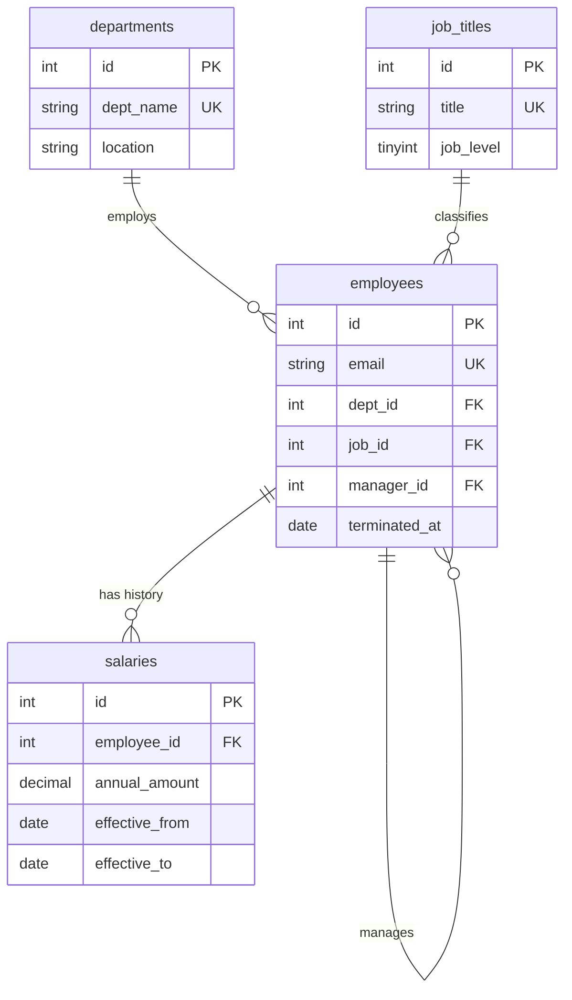

# HR / Payroll Database

An HR database built around one idea: **salary history is never overwritten.** A raise closes the current row and opens a new one, so every past compensation figure stays queryable. Views hide that versioning from callers, and a stored procedure makes the raise atomic.

## Model



**Two NULLs carry the state:** `employees.terminated_at IS NULL` means currently employed; `salaries.effective_to IS NULL` means the currently active salary. `manager_id` self-references `employees` to form the org chart.

## Views (`sql/03_views_procs.sql`)

| View | Purpose |
|---|---|
| `v_current_salary` | The active salary row per employee — encapsulates the `effective_to IS NULL` rule so no query has to remember it |
| `v_active_employees` | Denormalized roster: name, dept, title, level, manager, salary |
| `v_dept_payroll` | Headcount, total payroll, average salary per department — built *on top of* the view above |

Each view builds on the previous one. Change the versioning rule once, in `v_current_salary`, and every report follows.

## Stored procedure: `give_raise`

Doing a raise by hand is two statements that must both succeed. `give_raise(employee_id, new_amount, effective_date)` wraps them in a transaction with an exit handler that rolls back on any error, and guards against two real mistakes:

- raising an employee who has no active salary row → `SIGNAL` error
- a "raise" that is not actually an increase → `SIGNAL` error

It also takes `FOR UPDATE` on the current row, so two concurrent raises can't both close it.

```sql
CALL give_raise(4, 105000, '2024-06-30');
```

## Verified results

Views and KPI queries run in SQLite against the seed data:

| Department | Headcount | Annual payroll | Avg salary |
|---|---|---|---|
| Engineering | 4 | $493,000 | $123,250 |
| Sales | 3 | $340,000 | $113,333 |
| Finance | 1 | $91,000 | $91,000 |
| Marketing | 1 | $72,000 | $72,000 |

Company-wide: **9 active employees, $996,000 total payroll, $110,667 average.** Amara manages 3 reports, Ben manages 2. Raises on record: Amara +12.0%, Chloe +10.0%, Ben +9.7%, Kenji +9.1%.

Salary-band check by level shows no compression — level 5 averages $163,500, level 4 $132,000, level 3 $93,000, level 2 $72,000.

**On the stored procedure:** SQLite has no stored procedures, so I verified the *algorithm* rather than the MySQL syntax — running the close-then-insert sequence produced two salary rows for Diego (98,000 closed at 2024-06-30, 105,000 open from 2024-07-01), exactly one active row, and Engineering payroll correctly rising $493,000 → $500,000. The MySQL-specific syntax (`DELIMITER`, `SIGNAL`, `DECLARE EXIT HANDLER`) is written to spec but has not been executed against a live MySQL server.

## Run

```bash
mysql -u root -p < sql/01_schema.sql
mysql -u root -p hr < sql/02_seed.sql
mysql -u root -p hr < sql/03_views_procs.sql
mysql -u root -p hr < sql/04_kpis.sql
```

## Skills

Slowly-changing dimensions (versioned rows), layered views, transactional stored procedures with error handlers and `SIGNAL`, `FOR UPDATE` locking, self-referencing hierarchies, NULL-as-state modeling, HR KPI reporting.
