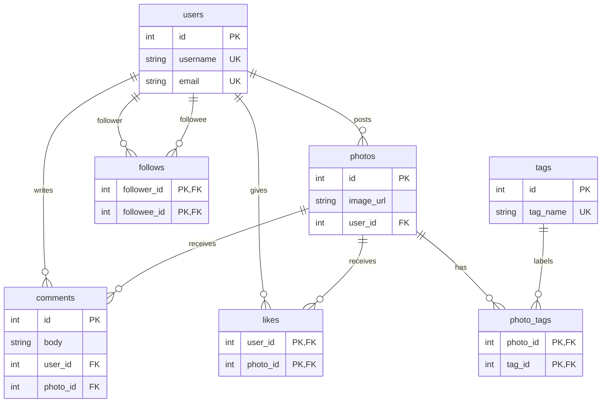

# Instagram Database System

A relational database for an Instagram-style photo-sharing platform — schema, sample data, and analytical SQL. Rebuild of a *Database Management Systems* team project (UML design + complex SQL on MySQL Workbench).

## Entity–Relationship model



## Design decisions

- **3NF, no redundancy.** Every non-key attribute depends on its key; join tables carry no derived data (like counts are computed, never stored).
- **`likes`** uses a composite primary key `(user_id, photo_id)` — one like per user per photo, enforced by the DB, not the app.
- **`follows`** is a self-referencing M:N on `users` with a `CHECK (follower_id <> followee_id)` so nobody follows themselves.
- **`photo_tags`** resolves the M:N between photos and hashtags.
- **`ON DELETE CASCADE`** everywhere a child cannot outlive its parent (delete a user → their photos, likes, comments, follows go too).
- Indexes on every foreign key used in the analytical joins.

## Files

| File | Contents |
|---|---|
| `sql/01_schema.sql` | `CREATE DATABASE` + 7 tables, keys, constraints, indexes |
| `sql/02_seed.sql`   | Sample users, photos, likes, comments, follows, tags |
| `sql/03_queries.sql`| 7 analytical queries |

## Analytical queries

1. Most-liked photos (leaderboard)
2. Most influential users by average likes/photo
3. Users who never posted (activation gap)
4. Mutual follows (friendship graph, self-join)
5. Top hashtags by usage
6. Engagement per photo = likes + comments, ranked with a `RANK()` window function
7. Follower / following counts per user (correlated subqueries)

## Run it

```bash
mysql -u root -p < sql/01_schema.sql
mysql -u root -p ig_clone < sql/02_seed.sql
mysql -u root -p ig_clone < sql/03_queries.sql
```

The query logic was verified against the seed data (e.g. photo 4 leads with 5 likes and rank 1 on total engagement; `ghost` is the only user with no posts; maya↔leo, maya↔aisha, aisha↔sofia are the mutual-follow pairs).

## Skills

Relational modeling (UML → schema), normalization to 3NF, referential integrity, joins / self-joins / correlated subqueries / window functions, MySQL.
