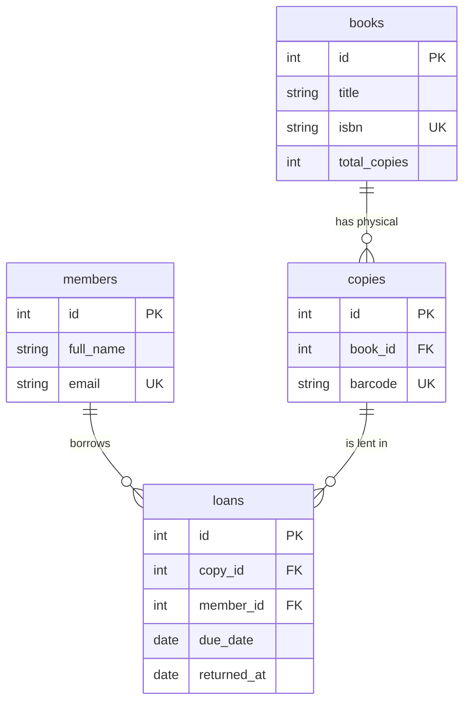

# Library Management Database

A relational database for a lending library — members, books, physical copies, and loans — with analytics for the two questions every library actually asks: *what's out, and what's overdue?* Includes a [SQL quick-reference](./SQL_REFERENCE.md).

## Model



**Key idea:** a `book` is the title; a `copy` is a physical item with a barcode; a `loan` links one copy to one member. `returned_at IS NULL` means the copy is still out — that single predicate drives availability and overdue detection. Due date = borrowed + 14 days.

## Queries (`sql/03_queries.sql`)

1. Currently checked-out copies
2. **Overdue** loans with days-overdue (`returned_at IS NULL AND due_date < today`)
3. Available copies per book (total − currently out)
4. Most-borrowed books
5. Members to email (have an overdue book)
6. Return punctuality: on-time vs. late per member

## Verified results

Against the seed data with "today" = 2024-03-01:
- **2 overdue loans** — Chloe / *Sapiens* (15 days), Amara / *Educated* (11 days)
- **4 loans currently open**
- Most-borrowed: *The Pragmatic Programmer* (3 loans)
- Punctuality: Chloe 0 on-time / 1 late, Ben 1 / 1, Amara 1 / 0

Logic checked in SQLite before commit.

## Run

```bash
mysql -u root -p < sql/01_schema.sql
mysql -u root -p library < sql/02_seed.sql
mysql -u root -p library < sql/03_queries.sql
```

## Skills

Schema design, 1:N and physical-vs-logical modeling (book↔copy), `LEFT JOIN`, `DATEDIFF`, NULL-based state, aggregate reporting.
