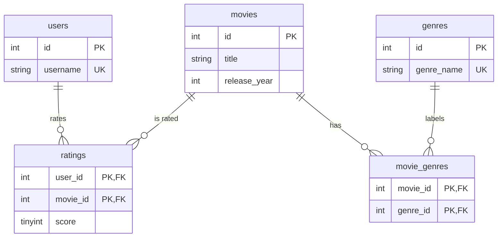

# Movie Ratings & Recommendations Database

A ratings database that generates recommendations from data alone — no recommendation table, no precomputed scores. "Users who liked X also liked…" is derived at query time from co-rating overlap, which is item-based collaborative filtering in plain SQL.

## Model



**Design notes:**
- `ratings` uses a composite key `(user_id, movie_id)` — one rating per user per film, enforced by the database.
- `CHECK (score BETWEEN 1 AND 5)` keeps the scale honest at the schema level.
- Recommendations are **never stored**. They fall out of self-joins on `ratings`, so they can never go stale.
- "Liked" is defined once as `score >= 4` and applied consistently.

## How the recommendation works

Join `ratings` to itself on `user_id`: the left side finds everyone who liked the movie you're viewing, the right side collects everything *else* those same people liked. Count and rank.

```sql
FROM ratings seed
JOIN ratings other ON other.user_id = seed.user_id
                  AND other.movie_id <> seed.movie_id
WHERE seed.movie_id = 1 AND seed.score >= 4 AND other.score >= 4
```

Q4 goes further: it finds your *nearest neighbours* (users sharing ≥2 likes with you), takes what they liked, and subtracts everything you've already rated — so it only ever suggests films that are new to you.

## Verified results

Seed data, verified in SQLite before commit:

**Users who liked *Arrival* also liked:** Blade Runner 2049 (3 co-likes, avg 4.67), then Dune, Whiplash, and Interstellar (2 each).

**Nearest neighbours to `amara`:** diego (3 shared likes), ben (3), kenji (2).

**Personalized picks for `amara`** — endorsed by her neighbours, unrated by her: **Whiplash** (2 endorsements, avg 4.5) and **Lady Bird** (1, avg 4.0).

**Top rated (≥2 votes):** Blade Runner 2049, Dune, and Whiplash tie at 4.67. **By genre:** Sci-Fi 4.54, Drama 4.43, Comedy 4.40, Thriller 4.33.

> A note on the data: the first seed pass produced an *empty* result for the personalized query — every neighbour had rated exactly the films `amara` had, leaving nothing to recommend. The query was right; the fixture was too narrow. Widened the ratings so the cold-start edge is visible rather than hidden.

## Run

```bash
mysql -u root -p < sql/01_schema.sql
mysql -u root -p movies < sql/02_seed.sql
mysql -u root -p movies < sql/03_queries.sql
```

## Skills

Collaborative filtering in SQL, self-joins on a junction table, `NOT IN` anti-joins to exclude seen items, composite keys, `CHECK` constraints, threshold-based aggregation.
