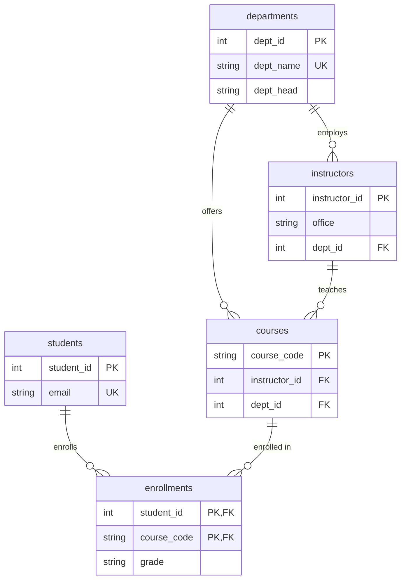

# Normalization Case Study: UNF → 1NF → 2NF → 3NF

One messy spreadsheet, walked through normalization one form at a time — with a script that **demonstrates each anomaly happening**, then proves the normalized schema prevents it.

Most normalization write-ups assert that anomalies exist. This one reproduces them.

```bash
python3 demo_anomalies.py     # no setup; runs in in-memory SQLite
```

## The starting point

A course-enrollment spreadsheet where every fact is repeated on every row:

| student_id | student_name | courses | instructor | instructor_office | department | dept_head | grade |
|---|---|---|---|---|---|---|---|
| 1 | Amara Diallo | `CS101, MA201` | Dr. Reed | E-204 | Computer Science | Dr. Vance | A |
| 2 | Ben Cohen | `CS101` | Dr. Reed | E-204 | Computer Science | Dr. Vance | B |

## The four stages

| Stage | Rule | What was wrong | Fix |
|---|---|---|---|
| **UNF** → **1NF** | Values must be atomic | `courses` held `"CS101, MA201"` | One row per (student, course); PK `(student_id, course_code)` |
| **1NF** → **2NF** | No *partial* dependency on a composite key | `student_name` needs only `student_id`; `course_name` needs only `course_code` | Split into `students`, `courses`, `enrollments` |
| **2NF** → **3NF** | No *transitive* dependency between non-key columns | `instructor → office`, `department → dept_head` | Promote `instructors` and `departments` to entities |

The functional dependencies driving each split:

```
student_id                → student_name, student_email      (partial → 2NF)
course_code               → course_name, instructor, dept     (partial → 2NF)
(student_id, course_code) → grade                             (full — stays)
instructor                → instructor_office                 (transitive → 3NF)
department                → dept_head                         (transitive → 3NF)
```

## Final schema



## The anomalies, actually demonstrated

Verified output from `demo_anomalies.py`:

**Update anomaly.** Dr. Reed's office is duplicated across 3 rows in 1NF. Updating one row leaves the database holding *two different offices for the same person* — `['E-310', 'E-204']`. No constraint can catch it, because nothing declares those cells should agree. In 3NF the office is stored once; one `UPDATE` and the report shows `['E-310']`.

**Insert anomaly.** A new course `CH100` with no enrolments yet cannot be recorded in 1NF — the primary key demands a student. SQLite lets a `NULL` student through and creates a junk row that pollutes every student query; MySQL rejects it outright, so the course simply cannot exist. In 3NF, `courses` is its own table: inserted cleanly, zero enrolments required.

**Delete anomaly.** Chloe drops PH110, her only Physics course. In 1NF that `DELETE` takes PH110, Dr. Ito, and the entire Physics department with it — rows mentioning Physics drop to **0**. In 3NF both survive.

**Lossless.** The decomposition throws nothing away: `v_enrollment_report` rejoins all five tables and returns the identical 6 rows the 1NF table held. Redundancy falls from ~60 stored values to ~18.

## When *not* to normalize

3NF optimizes for write correctness. Read-heavy analytics often denormalizes back into star schemas on purpose — the [e-commerce](../ecommerce-analytics-db/) project stores `unit_price` on each order line precisely so history doesn't move when a price changes. Normalization is a default, not a religion; know which anomaly you're trading away.

## Files

| File | Stage |
|---|---|
| `sql/01_unnormalized.sql` | The original flat table |
| `sql/02_first_normal_form.sql` | Atomic values, composite key |
| `sql/03_second_normal_form.sql` | Partial dependencies removed |
| `sql/04_third_normal_form.sql` | Transitive dependencies removed + reporting view |
| `demo_anomalies.py` | Runs every stage and proves the anomalies |

## Skills

Functional dependency analysis, normal forms (1NF/2NF/3NF), lossless decomposition, anomaly diagnosis, denormalization trade-offs.
