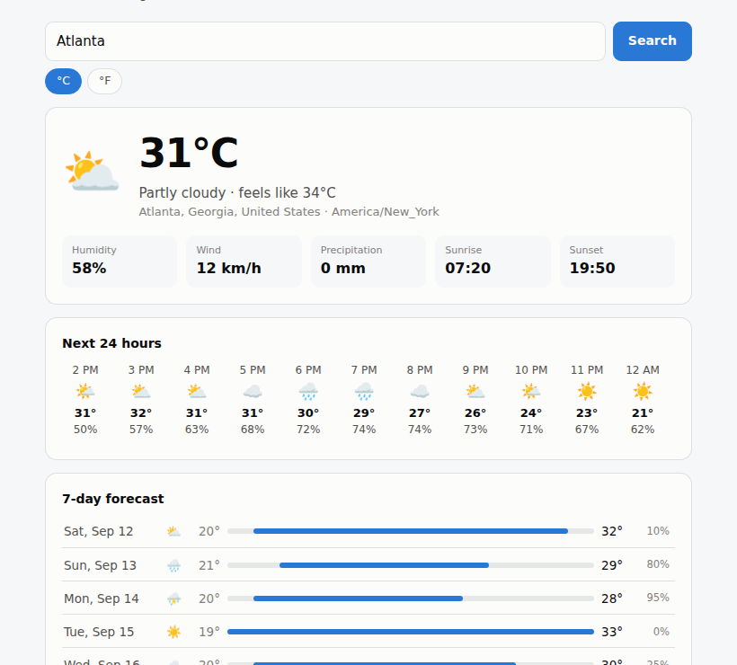

# Weather

Search any place on earth and get current conditions, a 24-hour strip, and a 7-day forecast. No build step, no dependencies, **no API key**.

**[▶ Open it](https://abenezer0101.github.io/projects/weather-app/)**



```bash
node test_weather.mjs     # 47 logic tests, offline
python3 -m http.server    # then open localhost:8000
```

## One deliberate departure from the brief

The roadmap entry called for "API key handled via user input, never committed." I built it on [Open-Meteo](https://open-meteo.com) instead, which **requires no key at all**.

That is strictly better than handling a key well: there is nothing to leak, nothing to rotate, nothing that can be accidentally committed, and the app works the instant someone clones it rather than after they register for a service. The safest secret is the one that doesn't exist.

The key-handling *pattern* is still implemented, for an optional keyed provider, because that was the skill worth demonstrating:

- the key is held in **`sessionStorage`, never `localStorage`** — it dies with the tab instead of sitting on disk
- the input is `type="password"` and is **cleared immediately** after saving
- it is displayed **masked** (`abcd••••••••5678`), never in full
- it is never written to any file, so it cannot end up in a commit
- a blocked storage write returns `false` rather than throwing

Browser tests assert the sessionStorage/localStorage split directly, because "we meant to use sessionStorage" is not the same as having done it.

## Design

`weather.js` holds every piece of logic that can be wrong without a network round-trip — URL construction, response mapping, WMO code translation, unit switching, error classification, key handling. It touches no DOM and makes no requests. `index.html` only renders what those functions return.

That split is what makes a network-dependent app testable offline.

**WMO weather codes.** Open-Meteo returns an integer (`0`, `61`, `95`); a person needs "Clear sky", "Light rain", "Thunderstorm". All 28 documented codes are mapped, and an unrecognised code degrades to `Unknown conditions (code N)` with a `❓` rather than rendering blank.

**The hourly feed needs filtering.** Open-Meteo returns a flat 7-day hourly array that *starts before the current hour*. Rendering it raw shows yesterday's weather as "next hours". The parser drops past entries and caps at 24.

**Errors say what to do.** A 401 mentions the key, 429 says wait, 5xx blames the service, and a failed fetch says check your connection — rather than surfacing `TypeError: Failed to fetch`.

## Verification

**This sandbox has no outbound network, so I could not make a live API call.** Rather than ship something unverified, testing is in two layers:

**47 logic tests** against recorded Open-Meteo fixtures — URL construction and coordinate validation, all WMO codes, place parsing, forecast parsing, the hourly past-filter, malformed and null responses, every error class, and key save/load/clear/mask including a storage failure.

**17 browser tests** with the real endpoints intercepted and answered from those fixtures, which exercises the entire path — fetch, parse, render — in a real browser:

| Check | Result |
|---|---|
| Multiple matches show a picker | 2 options |
| Current conditions render | 31°C, "Partly cloudy" |
| 7-day and hourly render | 7 rows, 24 hours |
| Unit toggle re-requests and survives | ✓ |
| HTTP 500 → readable message | "service is having problems" |
| No results → readable message | "No place found" |
| Network failure → readable message | "check your connection" |
| Key goes to sessionStorage | ✓ |
| Key **never** touches localStorage | asserted `null` |
| Input cleared, display masked | ✓ |

**Still unverified:** the live endpoints. The fixtures match Open-Meteo's documented response shape, but a real call from a real browser is the one thing I cannot confirm from here — check it once on first load.

> **A bug the screenshot caught.** The hourly strip showed 22° immediately after a 31° current reading. The app was correct; my *fixture* had an incoherent temperature curve, and an implausible screenshot undermines the whole project. Regenerated it from an actual diurnal sine so 14:00 agrees with the current reading. Day labels were also wrapping onto two lines in a column sized for "Sat, Sep 12" but not "Mon, Sep 14".

## Files

| File | Purpose |
|---|---|
| `weather.js` | All logic — pure, no DOM, no network |
| `index.html` | UI |
| `test_weather.mjs` | 47 offline tests |
| `fixtures/` | Recorded Open-Meteo responses |

## Skills

REST consumption, response normalisation, offline testing via fixtures and request interception, error-message design, secret handling in the browser, progressive disclosure.
